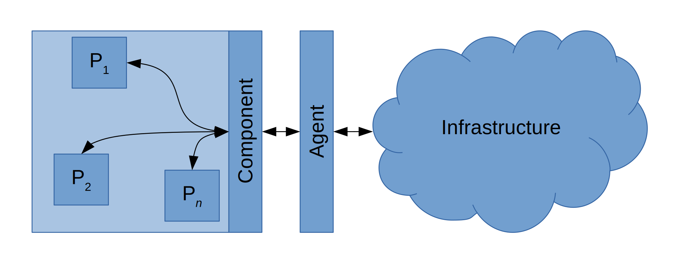

# Attribute-based Interaction in Google Go

## A Virtual Machine with Goat
We have already setup a machine to experiment with the goat API and the goat plugin. The plugin is a standalone application installed in the virtual machine. You only need to run and start working with directly. The virtual machine can be found here: [virtual machine](https://drive.google.com/open?id=0B9zaHQRMT9M3LVRUcXJnNG1EdXM). In the plugin, we also provide ready intersting examples, namely Stable Allocation and Smart Conference System. We will explain the first one in detail in this tutorial.

## CAS and Attribute-based Interaction:
Collective-adaptive systems offer an interesting notion of interaction where run-time contextual data are the driving force for selecting interaction partners.The attribute-based interaction has been proposed as a foundational theoretical framework to program CAS interactions. The framework permits a group of partners to interact by considering their run-time properties and their environment. 
We provide an interaction API for CAS in Go based on the formal model of attribute-based interaction. The API is parametric with respect to the infrastructure that mediates the interaction between components. We present three distributed infrastructures for handling message exchange and We implement them in Go. We also provide an Eclispe plugin to work with a higher level syntax that is less verbose. 

## How do components exchange messages?
The Attribute-based interaction was proposed (see [here](https://link.springer.com/chapter/10.1007%2F978-3-319-39570-8_1)) to mitigate the shortcomings of the classical paradigms when dealing with CAS interactions. To permit the construction of formally verifiable CAS systems, a kernel calculus for attribute-based interaction, named AbC, has been proposed. The interaction primitives of AbC abstract from the underlying communication infrastructure (i.e., they are infrastructure-agnostic) and relies on anonymous multicast communication where components interact based on mutual interests. Message transmission is non-blocking while reception is not. Each component has a set of attributes to represent its run-time status. Communication actions (both send and receive) are decorated with predicates over attributes that partners have to satisfy to make the interaction possible. A command send(v)@pi is used to send a tuple of values v to all components satisfying the predicate pi while receive(x)@pi' is used to receive a tuple of values on x with contents satisfying the predicate pi'.
Attributes are updated via assignments, [a:=v]. The interaction predicates are also parametrised with local attribute values and when values change, the interaction groups do implicitly change, introducing opportunistic interactions. 

In GoAt, we provide an infrastructure to handle message exchange in a way that respect AbC semantics. The infrastructure delivers a message to any component attached to it, by using TCP connections. The infrastructure, in order to enhance scalability, is implemented as a distributed system. 

GoAt implements many types of infrastructures: a centralized server, a cluster based infrastructure, a ring based infrastructure and a tree based infrastructure. For more information, see [LINK](infrastructure.md). Since each type of infrastructure interacts in a different way with its components, a piece of software (called agent) is put between the infrastructure and the component. Each agent is specialised in interacting with a precise infrastructure type. The following figure depicts how the parts interact between each other.

## Getting Started?

* The Eclipse plugin; [tutorial](plugin.md)
* The GoAt API in Google Go; [tutorial](library.md)
* The supported infrastructures; [tutorial](infrastructure.md)

