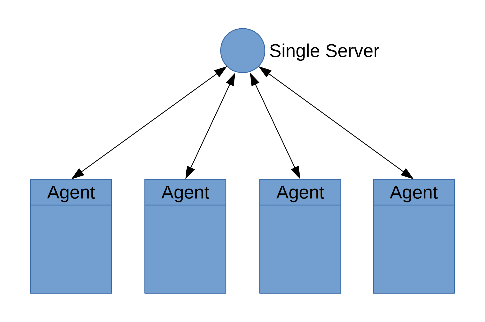
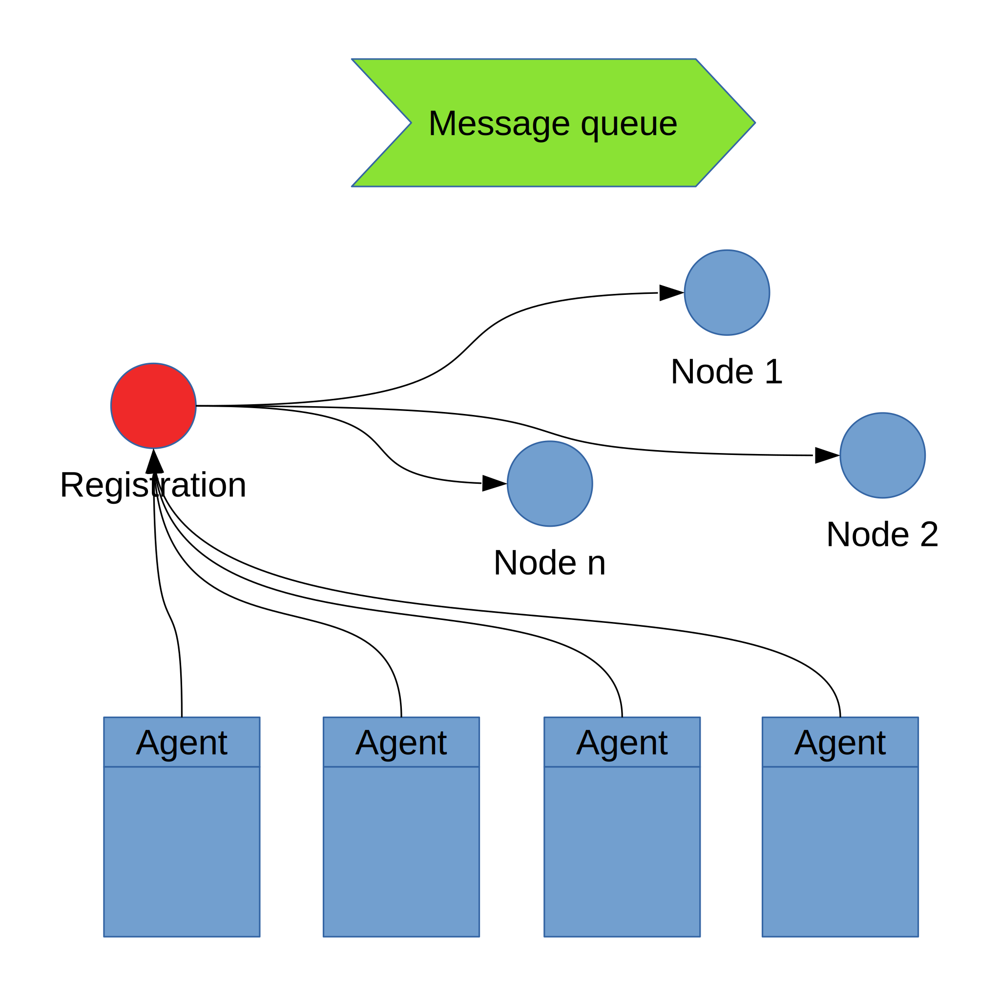
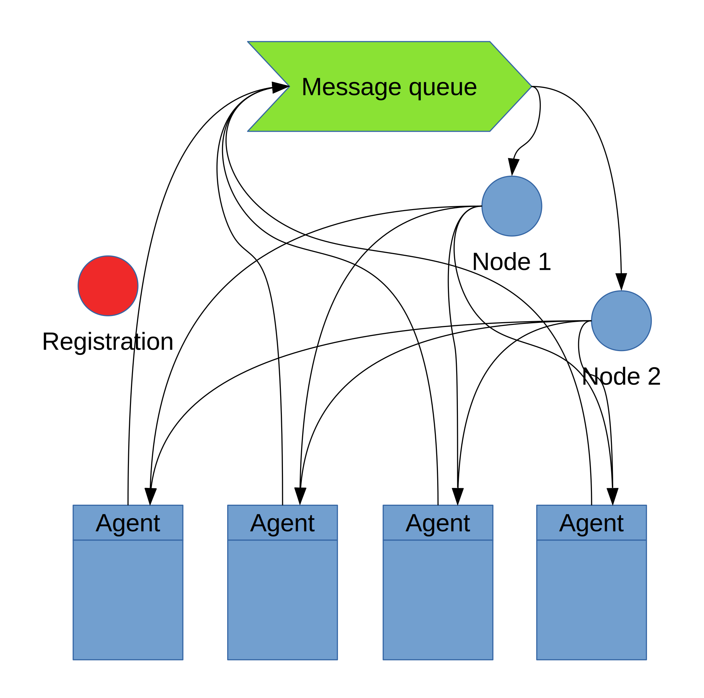
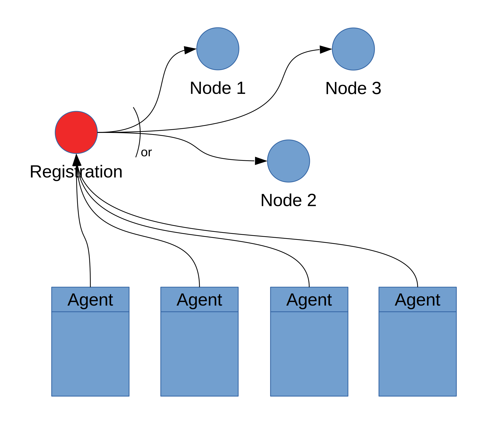
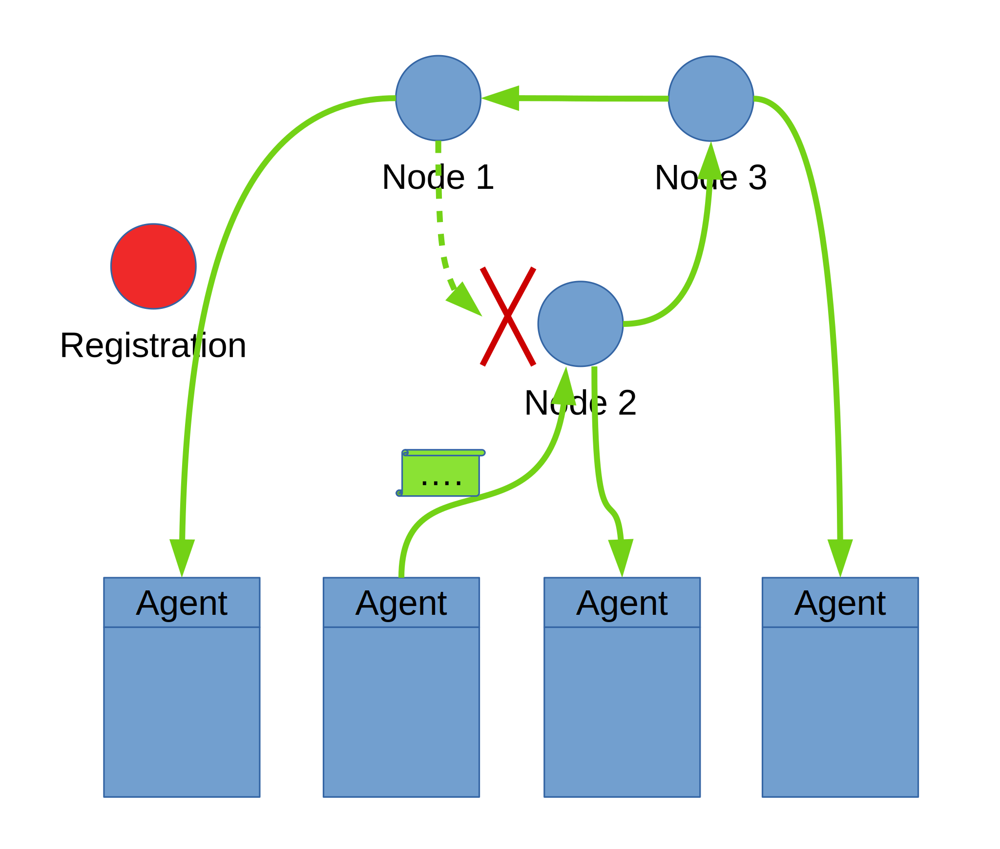
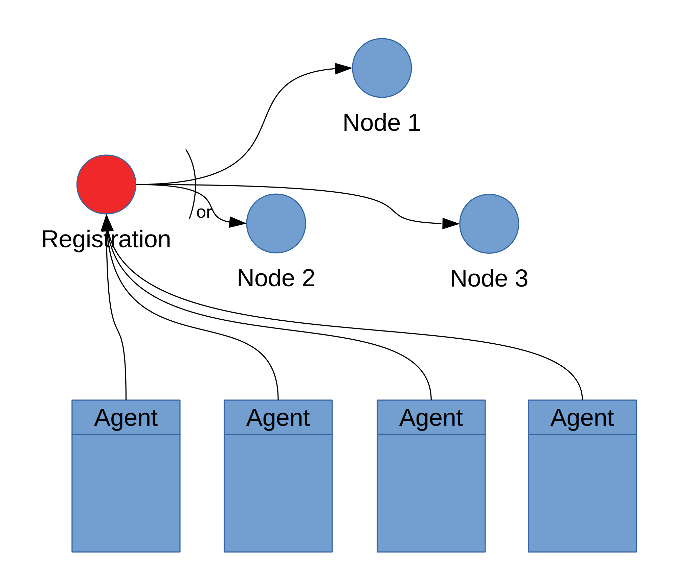
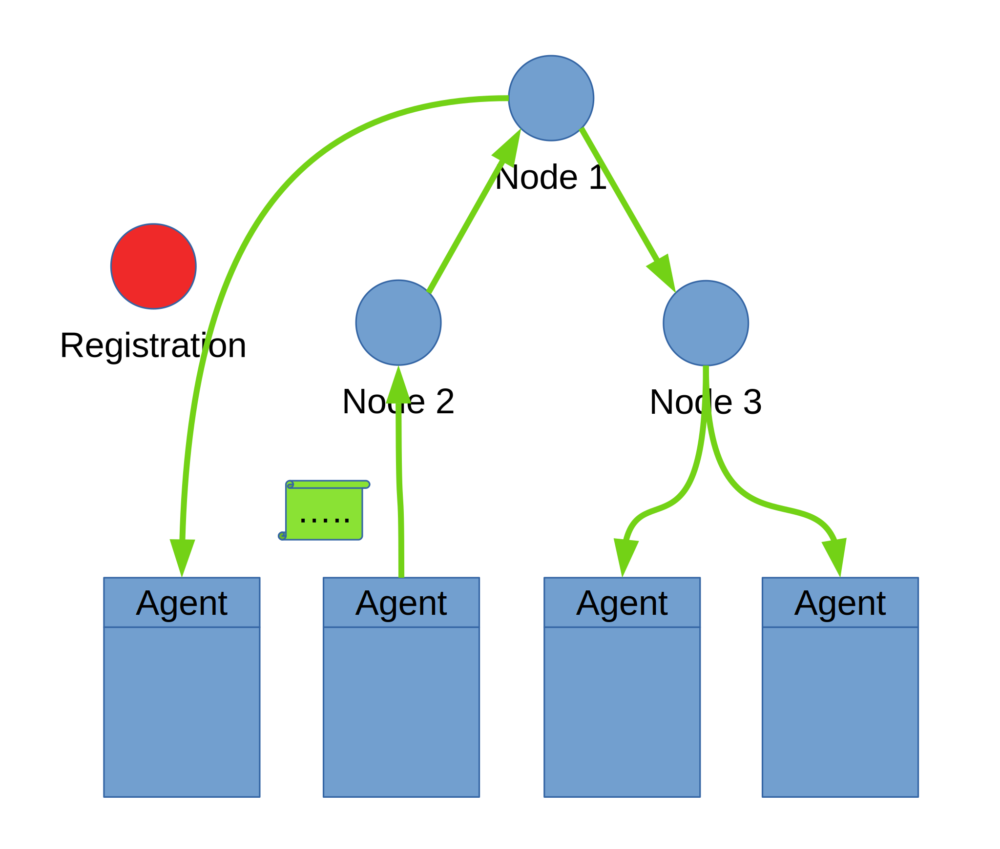

## The infrastructures
Each infrastructure has its own distinctive features, hence we will describe them separately. Since the infrastructures presented here are distributed, you need to create one program for each node type. Before running the components, you need to make sure that the infrastructure is up and running.

### Single Server
This is the simplest infrastructure: only one node that receives and dispatches messages to other components.

### Cluster infrastructure
This infrastructure has:
* a node that handles the registration procedure; it informs each serving node that a new component is available;
* a node that handles the message queue; the serving nodes share that message queue;
* a node that provides fresh message ids upon request;
* a set of serving nodes; they pick a message from the shared queue and distribute it to each registered components.
The following image depicts the registration procedure:

The following image depicts how messages are exchanged:

### Ring infrastructure
In this infrastructure, the serving nodes are connected between each other in a ring fashion. Each serving node has a next node, and it is the next node for some serving node. When a new component joins the infrastructure, its agent contacts the registration node. The registration node assigns the agent to a serving node. When the agent forwards a message, it sends the message to the associated serving node. The serving node forwards the message to the other agents assigned to it and to the next node. Each node forwards the message it receives to its agent and to its next node. When the message reaches the first node that forwarded it, it is discarded. This procedure removes the requirement of a centralised message queue. However, the issuance of the message ids is still performed by a single node.

The following image depicts how the registration procedure works:

The following image depicts how messages flow:

The following image depicts how a message is spread along the infrastructure when sent from an agent:

Summarising, to create a ring you need:
* a node that handles the registration procedure;
* a node that provides fresh message ids upon request;
* a set of serving nodes connected in a ring fashion.

### Tree infrastructure
In this infrastructure, the serving nodes are connected in a tree fashion. Each node (apart from one, called _root_) is connected to another serving node called _parent_. Each agent, to join the infrastructure, asks to the registration node to be associated with a serving node. When an agent wants to send a message, it asks to the associated node for a message id. Each node forwards the request for a new message id to its parent, unless it is the root. Then, the root assigns a fresh message id and forwards it to the child where the request came from. The message id is forwarded along the same path of the request (but in reversed order) so that the agent eventually receives it. After that, the agent emits the message to be sent (with the id it got). The message is sent to the associated serving node. Each node forwards the message to each node or agent associated with it but the node/agent where the message comes from. This infrastructure lifts the requrement of a special node that assigns message ids, as this task is performed by the root. It is easy to see that each message is delivered exactly once to each agent connected to the infrastructure (but the sender).

The following image depicts how the registration procedure works:

The following image depicts how nodes interact:

The following image depicts how a message id request is carried out:

The following image depicts how a message is spread along the infrastructure when sent from an agent:

